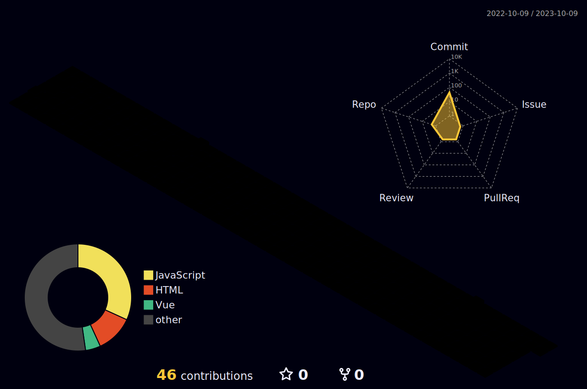

  
   
  

  

<!-- ESTATÍSTICAS -->

      <h2 id="statistics">
            <em><strong>Minhas Estatísticas</strong></em>
            
      </h2>
      <!-- LANGUAGES + STATS -->
      

            

                  <em><strong>Commits</strong></em> 💚
            

             
            
      

      <!-- LANGUAGES + STATS -->
      

            

                  <em><strong>Linguagens utilizadas + Status</strong></em> 💻
            

             
            
            
      

       <!-- STREAK -->
      

            

                  <em><strong>Sequências de commits</strong></em> ⚡
            

             
            
      

      <!-- GRÁFICO -->
      

            

                  <em><strong>Commits no último mês</strong></em> 📅
            

             
            
      

 
  
<b>Visitors Count</b>
  
  

 
 

